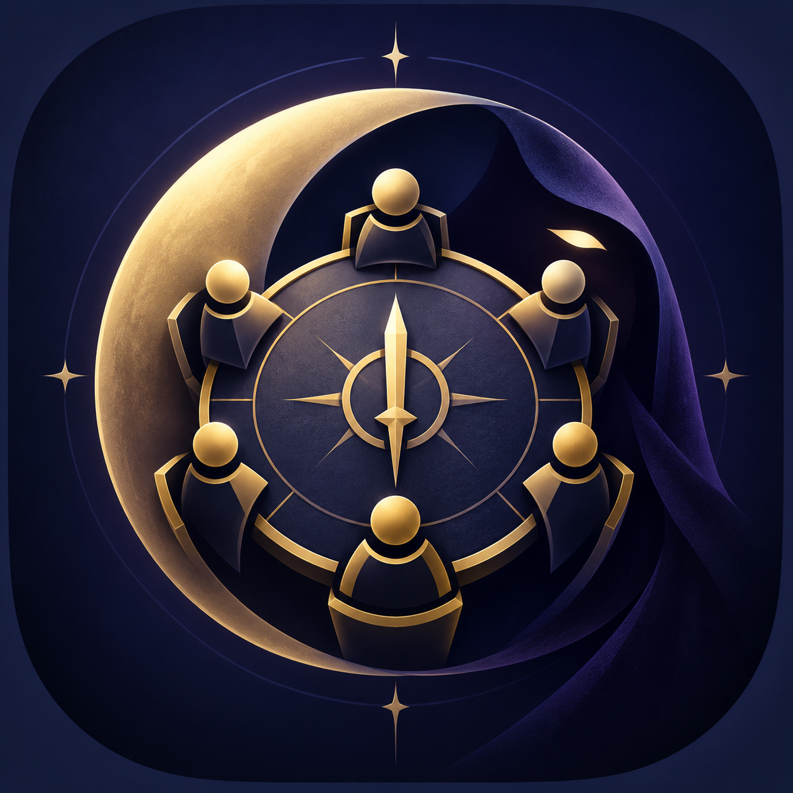
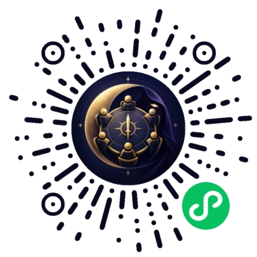

<p align="center">
  
</p>

<h1 align="center">桌边助手 · ShadowTable</h1>

<p align="center">线下讨论，线上发牌。为 6–12 人阿瓦隆聚会提供身份、投票、任务与技能结算辅助。</p>

<p align="center">
  <a href="#扫码体验">扫码体验</a> ·
  <a href="#支持的玩法">支持的玩法</a> ·
  <a href="#本地开发">本地开发</a> ·
  <a href="#部署与发布">部署与发布</a> ·
  <a href="#项目文档">项目文档</a>
</p>

## 扫码体验

<p align="center">
  
</p>
<p align="center">使用微信扫一扫，打开「桌边助手」小程序。</p>

1. **创建牌桌**：选择人数和板子，填写桌上昵称；朋友通过邀请或 6 位房间码加入。
2. **入座发牌**：选择座位，全员准备后由房主发放身份；每人在自己的手机上查看身份和初始视野。
3. **按需操作**：线下讨论，房主根据现场进度发起投票、任务或对应板子的技能操作。
4. **结束再开**：线下完成最终结算，由房主结束本局；可在同一牌桌重新准备、再开一局。

「我的牌桌」可找回已加入的房间。切换牌桌不会退出当前对局；准备阶段可离席，房主还可转交管理权或删除牌桌，并在准备阶段或对局结束后从房间设置移出玩家。

## 功能亮点

- **私密身份与视野**：身份默认遮盖，主动查看；小程序切到后台会清除私密展示内容。
- **自由安排流程**：投票可独立发起，任务自选队员及一张／两张失败票门槛，不强制按固定阶段推进。
- **秘密提交、自动结算**：参与者收齐提交后自动展示结果，任务仅等待队员；房主能查看完成进度，不能查看秘密票型或目标。
- **等待兜底与结果回看**：房主可确认后结束等待，投票未提交记弃权、技能按本次不使用处理，任务或必选目标操作作废；最近公开结果在下一项开始后仍保留。
- **扩展板辅助**：支持逆仆、影中执刃、混沌契约和十二骑士，线上能力与线下结算分工见下表。
- **房间恢复与同房重开**：服务端使用 SQLite 保存房间和操作记录，微信重新登录可恢复同一用户的牌桌。
- **开发与管理入口**：提供网页版玩家入口、本地陪测面板和可选的正式管理平台。

## 支持的玩法

| 玩法     | 人数            | 当前支持范围                                                                         |
| -------- | --------------- | ------------------------------------------------------------------------------------ |
| 经典基础 | 6、7、8、10、12 | 按人数配置身份与初始视野，支持投票、任务；12 人含双奥伯伦                            |
| 逆仆     | 9、11           | 经典操作及刀逆仆，阵营变化私密呈现；匪队在线下决策                                   |
| 影中执刃 | 12              | 身份与初始互认视野、投票、任务；特殊盘刀和最终胜负在线下完成                         |
| 混沌契约 | 12              | 身份与初始互认视野、魔法票与盗贼失败票结算；首夜绑定、特殊盘刀与排名在线下完成       |
| 十二骑士 | 12              | 秘密技能提交与依序结算、守护／换号／替死、猎人链、B 牌复活、身份转换、仙女与先知视野 |

所有板子均以**按需工具、操作收齐自动结算、房主手动结束整局**为主：不会因为三次任务成功／失败、连续否决或单次操作结果自动结束整局。当前小程序不提供刀梅林入口，最终刀梅林在线下进行。影中执刃的完全自动胜负模式未开放。

十二骑士换牌后会向本人提示新身份，主动技能在下一技能周期启用，先知视野自动更新。房主可在「房间设置」开启已结算技能过程的公开展示，默认隐藏；最终出局与复活座位仍会公示，新牌身份仅本人可见。

详细角色、技能和操作约定见 [规则说明](docs/rules.md)。该文档保留了规则演进记录，同一事项以靠后的最新补充为准。

## 本地开发

使用原生微信小程序、单体 Node.js HTTP 服务和 SQLite。服务端无第三方运行依赖，无需 Redis 或消息队列。

### 启动服务

需要 **Node.js ≥ 22.13.0**（使用内置 `node:sqlite`；生产镜像使用 Node 24）及 npm。

```sh
npm ci
npm run dev
```

默认服务地址为 `http://127.0.0.1:8787`，数据库位于 `data/shadowtable.sqlite`。开发命令同时启用匿名开发登录、本地陪测和网页版入口：

| 入口     | 地址                           | 用途                                   |
| -------- | ------------------------------ | -------------------------------------- |
| 网页版   | `http://127.0.0.1:8787/`       | 浏览器玩家入口                         |
| 本地陪测 | `http://127.0.0.1:8787/dev`    | 添加独立测试玩家、准备、投票与技能操作 |
| 健康检查 | `http://127.0.0.1:8787/health` | 检查服务状态                           |

开发登录每次新登录生成独立身份；清除会话后无法恢复原开发身份。测试多名玩家时使用独立设备、独立存储环境或陪测面板。

### 运行微信小程序

1. 在微信开发者工具中导入项目根目录，工具会读取 `project.config.json`。
2. 使用自己的小程序 AppID；仓库已配置项目 AppID，自行部署时需要替换。
3. 本地联调使用 `miniprogram/config.js` 中的 `baseUrl: "http://127.0.0.1:8787"` 和 `devAuth: true`，与 `npm run dev` 配套。
4. 在开发者工具的本地设置中关闭 request 合法域名校验，然后编译运行。
5. 创建牌桌后，可在 `/dev` 输入房间码、补齐测试玩家并全部准备，再回到小程序开局。

真机访问本地服务时，不能使用手机上的 `127.0.0.1`。同网调试需将 `baseUrl` 改为电脑的局域网地址，并以 `HOST=0.0.0.0 npm run dev` 启动服务；正式环境使用 HTTPS 和微信 request 合法域名。

陪测面板仅操作独立测试账号，不代替真人提交。默认隐藏测试玩家身份，可手动展开；清空陪测玩家时会保留真人和牌桌。面板仅允许本机访问，且必须同时启用 `DEV_AUTH=1`、`DEV_PANEL=1`；生产环境不可用。

### 检查与测试

```sh
npm test
npm run check
```

`npm test` 运行 Node.js 测试，`npm run check` 检查主要服务端和客户端脚本语法。真机与人工验收范围见 [验证记录](docs/verification.md)。

### 目录结构

```text
miniprogram/       原生微信小程序页面与接口调用
server/           HTTP API、规则引擎与 SQLite 存储
  web/            网页版玩家入口
  dev-panel/      本地陪测面板
  admin/          正式管理平台
tests/            自动化测试
deploy/cloud/     容器部署、预检与回退脚本
docs/             规则、架构、部署说明与 README 图片
```

## 部署与发布

服务端采用单实例 Node.js + SQLite，使用 Docker Compose 部署；独立 Caddy 网关提供 HTTPS。仓库已提供 GitHub Actions 流程：推送 `main` 后执行验证、构建镜像并通过 SSH 部署，健康检查失败时回退应用镜像。

完整的服务器初始化、镜像仓库、Secrets、网关和备份配置见 [部署文档](docs/deployment.md)。环境变量示例见 [.env.example](.env.example) 和 [容器部署配置](deploy/cloud/app.env.example)。**Node 不会自动加载 `.env`，需由运行环境或 Compose 注入。**

| 配置                                  | 用途                                                |
| ------------------------------------- | --------------------------------------------------- |
| `WECHAT_APP_ID` / `WECHAT_APP_SECRET` | 小程序服务端微信登录凭据                            |
| `HOST` / `PORT`                       | 监听地址与端口，默认 `127.0.0.1:8787`               |
| `DB_PATH`                             | SQLite 文件路径，默认 `data/shadowtable.sqlite`     |
| `WEB_ORIGIN`                          | 启用网页版与访客登录，生产环境使用完整 HTTPS 源地址 |
| `ADMIN_ORIGIN` / `ADMIN_KEY`          | 两项同时配置后启用 `/admin`，详见部署文档           |
| `DEV_AUTH` / `DEV_PANEL`              | 开发登录与本地陪测开关，生产环境设为 `0`            |

生产服务启动示例（其余配置由环境注入）：

```sh
NODE_ENV=production DEV_AUTH=0 DEV_PANEL=0 PORT=8787 npm start
```

小程序需单独上传发布：配置自己的 AppID、HTTPS `baseUrl` 和 request 合法域名，将客户端 `devAuth` 改为 `false`。AppSecret 仅放在服务端。

正式管理平台支持房间概览、为准备阶段房间开启陪测、清理测试座位、终止／删除房间及操作审计。生产陪测不依赖开发登录开关。

SQLite 仅由一个服务实例写入；备份使用 SQLite 在线备份或停服备份完整数据目录，不要在运行时仅复制主文件而遗漏 WAL。自动发布回退只恢复应用镜像，不恢复数据库。

## 隐私与操作约定

- 房主也是玩家，不拥有全员身份或秘密行动查询权限；完成进度不包含具体提交内容。
- 小程序不持久化身份；私密接口按当前玩家返回角色、视野与合法动作。组队票在结算后公开，任务牌只展示汇总。
- 十二骑士的技能过程公开属于房间设置，开启前需要确认；新抽取的身份牌面始终仅本人可见。
- 切换未结算操作前需确认作废，已发身份和已结算记录保留；结束本局不会额外公开全员身份。
- 网络结果不确定时使用原请求编号重试，避免重复操作；切到后台后不会自动重新揭示身份。

## 项目文档

| 文档                                           | 内容                                     |
| ---------------------------------------------- | ---------------------------------------- |
| [规则说明](docs/rules.md)                      | 角色配置、线上操作与扩展板规则           |
| [规则待确认项](docs/rule-questions.md)         | 规则歧义与历史讨论，结合最新规则说明阅读 |
| [规则原文快照](docs/sources/custom-boards.txt) | 自定义板子的参考原文                     |
| [架构与接口](docs/architecture.md)             | 服务结构、数据模型与 API                 |
| [部署指南](docs/deployment.md)                 | 容器、CI/CD、网关、备份及运维            |
| [验证记录](docs/verification.md)               | 测试记录与真机验收                       |

## 许可证

本项目原创代码采用 [MIT License](LICENSE)，允许商业使用、修改和分发，使用时须保留版权及许可声明。第三方依赖、引用的规则文档、图片及其他第三方素材的权利归各自权利人所有，不因本项目的 MIT 许可而重新授权。
